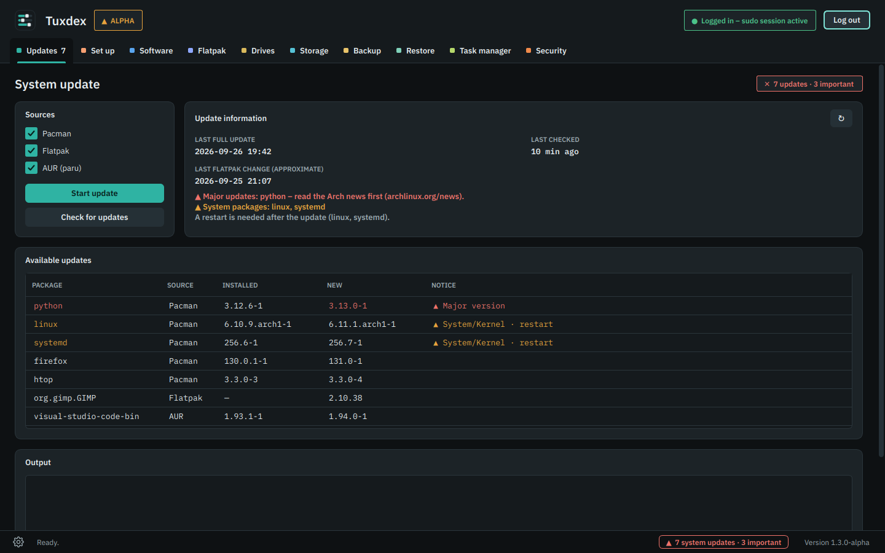
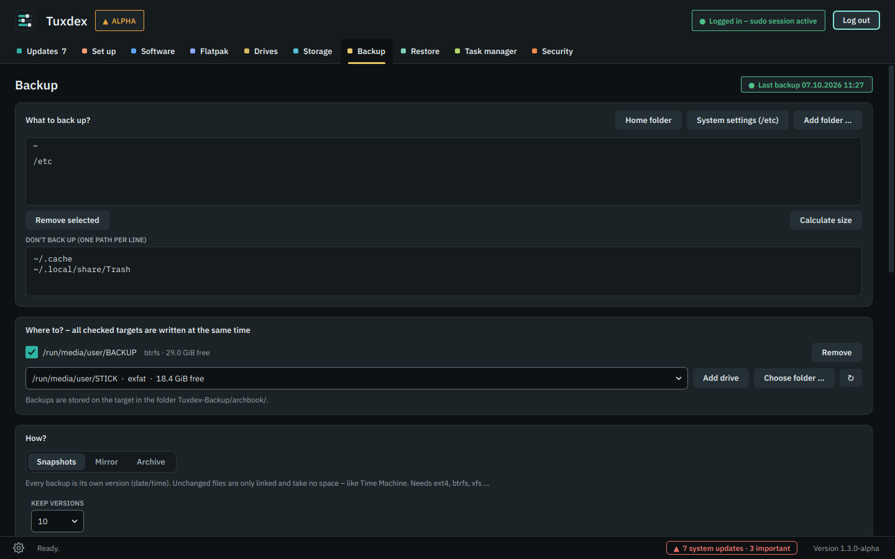
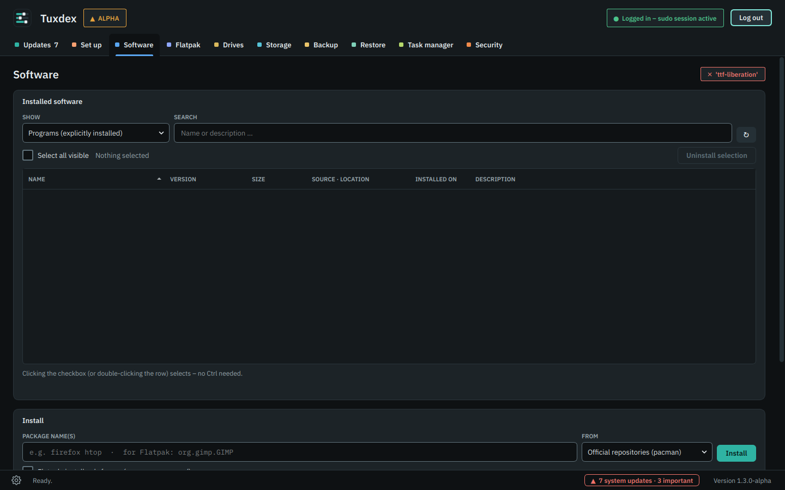
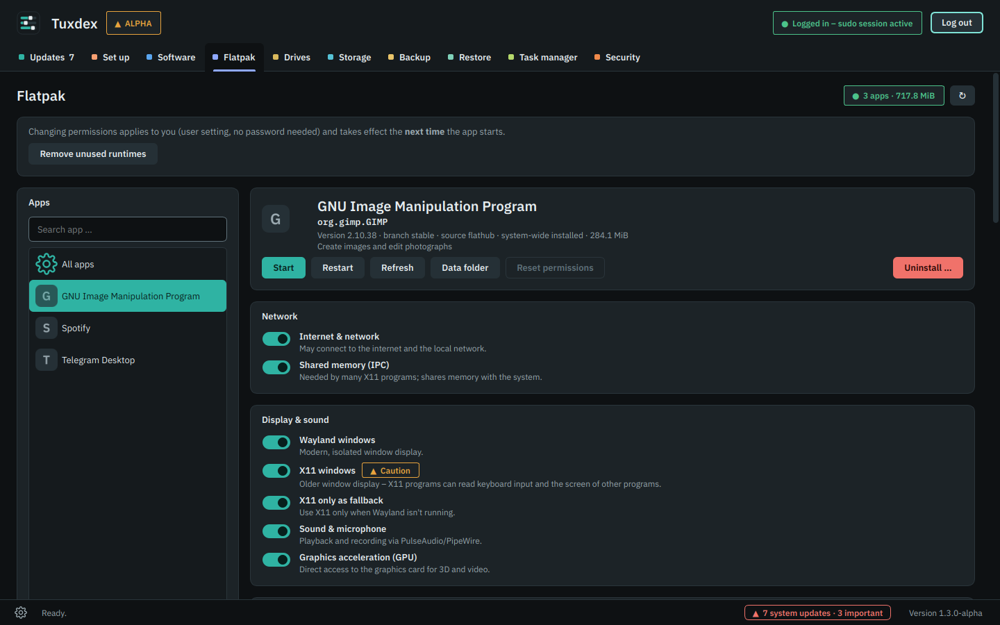
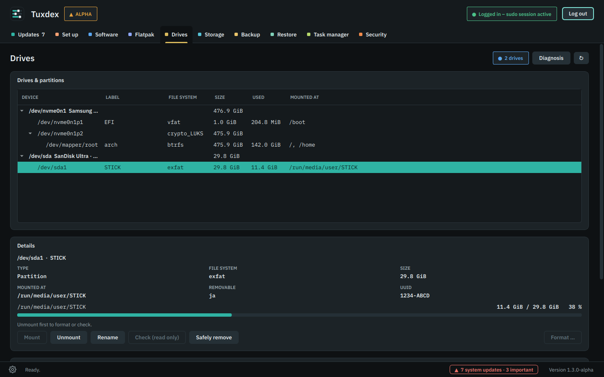
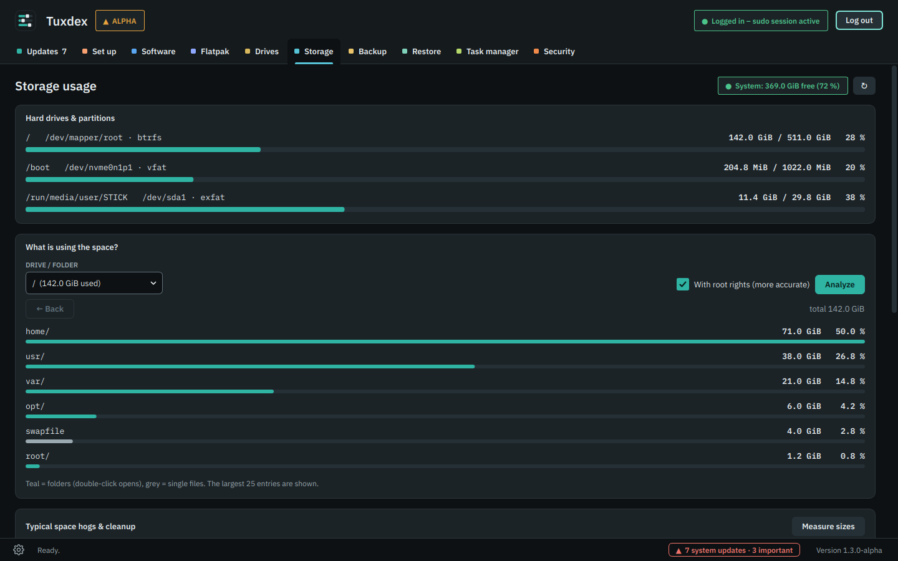
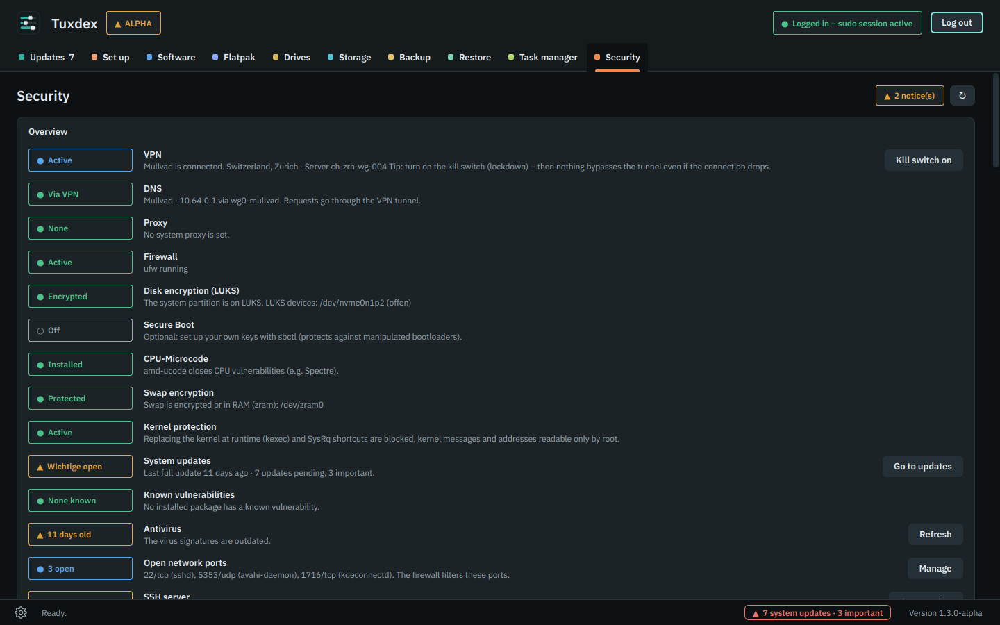
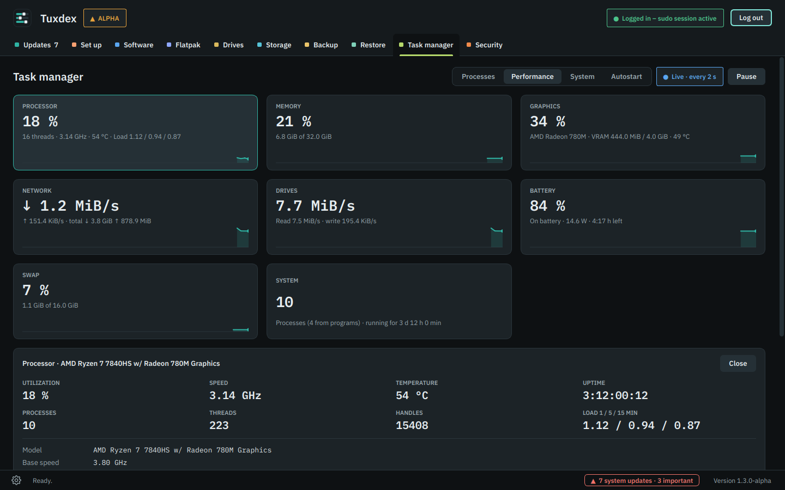
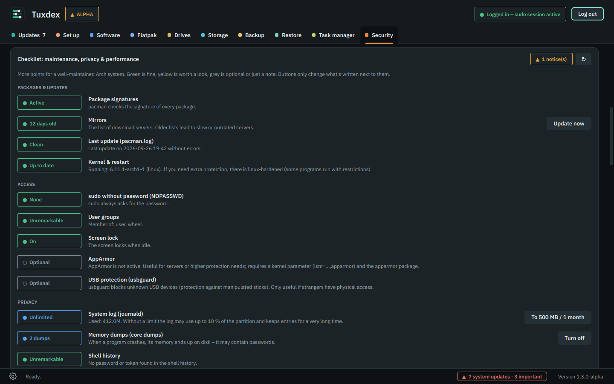
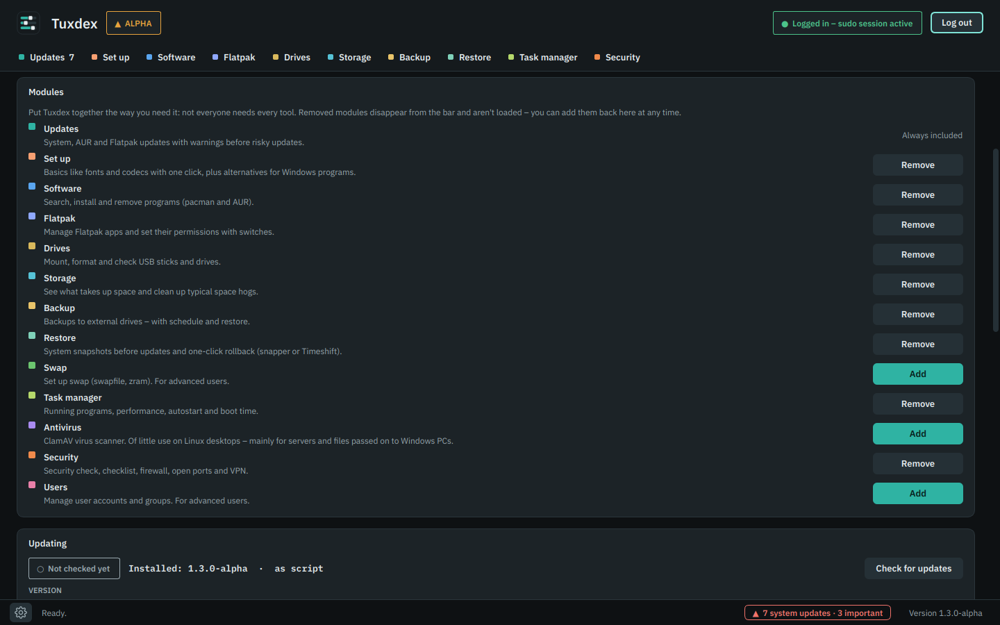

<p align="center">
  
</p>

<p align="center">
  <b>Graphical system management for Arch Linux – everything in one window, no terminal.</b>
</p>

<p align="center">
  <a href="README.md">Deutsch</a> · <b>English</b>
</p>

<p align="center">
  
  
  
  
  
  
</p>

<p align="center">
  
</p>

> [!WARNING]
> **Alpha version.** Actions with administrator rights (root) change your system directly. Tuxdex asks for your consent once before the first such action. Use at your own risk – make a backup first.

---

## What is Tuxdex?

Tuxdex bundles into one clear interface what otherwise takes a dozen terminal commands: updates, packages, USB sticks, disk space, backups, processes, virus scans, firewall and VPN.

Every command runs **visibly** in the output box, so you always see what's happening. Questions from `pacman` or `paru` appear as windows. The sudo password is asked **once per session** and never stored.

### Who is Tuxdex for?

- **People coming from Windows** who want an easy start with Arch Linux – without having to learn dozens of commands first. Updates, programs, USB sticks, backups: all with a click, the way you're used to.
- **Everyone who loves graphical interfaces** and would rather manage their system in a tidy window than in the terminal.
- **The curious**: every command runs visibly – so you learn what happens under the hood along the way.

Tuxdex isn't meant for pros who do everything in the terminal – but it's still handy as a quick overview.

**Language:** English and German. Tuxdex follows your system language; you can switch under **Settings (gear at the bottom left) → Language**.

<p align="center">
  
</p>

## Modules

Tuxdex is a **toolkit**: under **Settings → Modules** you choose which tools appear in the bar – not everyone needs every tool. Removed modules aren't loaded at all. Updates is always included; **Swap, Antivirus and Users** are hidden at first because they're more for advanced users.

| Module | What it does |
|---|---|
| **Updates** | Checks for updates automatically at startup (pacman, AUR via paru, Flatpak – can be turned off) and shows the count on the tab and at the bottom right · install with one click · **major updates** and kernel/system packages are marked · restart notice · the check result is kept after closing |
| **Software** | All packages with icon, version, size, source/location and install date · select with checkboxes and uninstall together · install from pacman, AUR (paru) or Flathub |
| **Flatpak** | Permissions of every Flatpak app with switches – network, files & folders, devices, sound, display, environment variables, portal permissions · rules for all apps · risky permissions are marked, changes highlighted · set up Flathub, start, update and uninstall apps |
| **Drives** | Drives and partitions as a tree · mount, unmount, rename, check, **format** (ext4, btrfs, xfs, exFAT, FAT32, NTFS), safely remove · detects new USB sticks automatically · system partitions are protected |
| **Storage** | Usage per drive · “What is using the space?” with drill-down into folders · cleanup: package cache, orphaned packages, journal, trash, Flatpak |
| **Backup** | Snapshots (versioned, space-saving), mirror or compressed archives (zstd/xz/gzip, optionally with password) · **several targets at once** · verification after writing · custom names with date ([how it works](#naming-backups)) · old versions cleaned up automatically · restore · daily/weekly schedule |
| **Swap** *(hidden at first)* | Create and remove a swap file, set swappiness |
| **Task manager** | Processes with program icons, CPU, RAM, disk I/O, energy estimate · performance tiles with details on click: CPU (clock, caches, virtualization), RAM (speed, slots, type), drives, GPU (clock, power, VRAM, PCIe), network, battery, fans · system: CPU/GPU name, mainboard, IP addresses, DNS · **autostart & boot time** · **version status** of graphics driver, microcode, BIOS, kernel, firmware |
| **Antivirus** *(hidden at first)* | ClamAV is mainly meant for servers and of little use on Linux desktops – an own tool for desktop users is on the [roadmap](#roadmap). Front end for an already installed ClamAV (optional): update signatures, scan folders or the whole system – with **live progress** (files, data, speed, time left) and whether the scan is running or stuck · quarantine with restore |
| **Security** | Security check (VPN, DNS, proxy, firewall, LUKS, Secure Boot, CPU microcode, swap encryption, kernel protection, updates, antivirus, open ports, SSH, known vulnerabilities) · **checklist for maintenance, privacy & performance** (package signatures, mirrors, sudo, log size, core dumps, shell history, TRIM, I/O scheduler, NTP, old kernel modules, package list …) · **DNS leak test & VPN/proxy detection** · **block/allow open ports with a button** · front end for an already installed **Mullvad VPN** (optional: account, location, kill switch, DNS filters) · ufw firewall with rules |
| **Users** *(hidden at first)* | User accounts and last login |

## Roadmap

Goals and plans – what's already there and what comes next.

**Planned**
- [ ] **System restore**: automatic snapshot before every update (Timeshift or snapper), rollback with one click.
- [ ] **Driver assistant**: detect NVIDIA, Wi-Fi, printers and Bluetooth and set them up with one click.
- [ ] **"Find an alternative"**: type "Photoshop" → GIMP, Krita, Photopea; "Office" → LibreOffice, OnlyOffice – each with an install button.
- [ ] **Gaming setup**: Steam, Proton, Lutris/Heroic and Wine/Bottles in one step, plus a note on which games won't run because of anti-cheat.
- [ ] **Windows data**: mount NTFS partitions, detect dual boot, bring over files from "C:\Users".
- [ ] **Troubleshooting in plain language**: "Why is my Wi-Fi gone?" instead of logs, plus a device manager.
- [ ] **One-click basics**: Microsoft fonts and codecs, default apps, power profiles.
- [ ] **CachyOS support**: detect and show CachyOS kernels.
- [ ] **Interactive learning software** for Arch Linux, connected to Tuxdex: learn commands step by step – see the matching command for every action in Tuxdex, understand it and try it yourself.
- [ ] **Ready-made, tested ISOs**: Arch Linux with KDE Plasma and Tuxdex, already set up – with an installer that's much simpler than today's Arch installation.
- [ ] **Own security tool for desktop users** to replace ClamAV.
- [ ] **Module market**: more modules you add as needed.

**Done**
- [x] Modules as a toolkit – add and remove them (1.2.0)
- [x] English interface and README (1.1.0)
- [x] Own pacman repository, no AUR needed (1.1.0)
- [x] Security review of all root actions (1.1.0)

Ideas and wishes are welcome as an [issue](../../issues).

## Screenshots

<p align="center">
  
</p>

| Updates | Backup |
|---|---|
|  |  |
| **Software** | **Flatpak** |
|  |  |
| **Drives** | **Storage** |
|  |  |
| **Security** | **Task manager** |
|  |  |
| **Checklist** | **Modules (settings)** |
|  |  |

<sub>The screenshots show sample data.</sub>

## Installation

### Via pacman (recommended)

Tuxdex has its own pacman repository – no AUR, updates come with `pacman -Syu`. Add this once at the end of `/etc/pacman.conf`:

```ini
[tuxdex]
SigLevel = Optional TrustAll
Server = https://github.com/PyloGER/Tuxdex/releases/latest/download
```

Then install:

```bash
sudo pacman -Sy tuxdex
```

`SigLevel = Optional TrustAll` means: the packages are not (yet) signed with a dedicated key, pacman trusts the HTTPS connection to GitHub. As soon as signatures are available, this section will explain how to import the key.

### Build it yourself

Requirements: `base-devel` and `git`.

```bash
git clone https://github.com/PyloGER/Tuxdex.git tuxdex
cd tuxdex
makepkg -si
```

`makepkg` installs missing dependencies, builds the package and installs it via pacman. Afterwards you'll find **Tuxdex** in the application menu; in the terminal it starts with `tuxdex`.

### Updating

Tuxdex checks for a new version at startup and offers it in a window (can be turned off under **gear at the bottom left → Updating**). You can also check manually there at any time: Tuxdex checks the GitHub repository, shows what's new and installs the new version with one click (builds with makepkg, installs with pacman, restarts). Alternatively “From file …” (tuxdex-X.Y.Z.tar.gz) or “From folder …” (e.g. your Git clone – `git pull` runs automatically first).

Or in the terminal:

```bash
cd tuxdex
git pull
makepkg -si
```

### Removing

```bash
sudo pacman -R tuxdex
```

The saved update check and the quarantine are stored in `~/.cache/tuxdex` and `~/.local/share/tuxdex` and are kept when removing.

### Try without installing

```bash
sudo pacman -S --needed python pyside6
python3 tuxdex.py
```

## Naming backups

Under **Backup → Backup name** you decide what snapshot folders and archive files are called. That way you can see from the name when a backup was made.

Write any text and insert the date with placeholders:

| Placeholder | becomes | Example |
|---|---|---|
| `yyyy` | year | 2026 |
| `mm` | month | 09 |
| `dd` | day | 27 |
| `HH` | hour | 10 |
| `MM` | minute | 15 |
| `SS` | second | 00 |

Examples (backup on 27 Sep 2026 at 10:15):

| Input | Backup name |
|---|---|
| *(empty)* | `2026-09-27_101500` (default) |
| `yyyy-mm-dd` | `2026-09-27` |
| `Laptop_yyyy-mm-dd` | `Laptop_2026-09-27` |
| `yyyy-mm-dd before update` | `2026-09-27 before update` |
| `Photos yyyymmdd_HHMM` | `Photos 20260927_1015` |

- A placeholder is only replaced if it doesn't touch letters directly. `Summer` stays `Summer`. Separate text and placeholders with `_`, `-`, a dot or a space.
- Lowercase `mm` is the month, uppercase `MM` the minute.
- If the name already exists on a target (e.g. two backups on the same day with `yyyy-mm-dd`), Tuxdex appends `_2`, `_3` …. Add `HH` and `MM` if you back up more than once a day.
- Archives get their extension automatically (`.tar.zst`, `.tar.xz` …, encrypted additionally `.gpg`).
- Below the input field Tuxdex shows what the backup would be called today.
- The mirror has no name, it is always just one copy.
- Sorting and cleaning up old versions use the real backup time, not the name. Tuxdex stores it in `Tuxdex-Backup/<hostname>/.tuxdex-names.json` on the target. Older backups with the default name stay unchanged.

## Dependencies

**Required** (`makepkg -si` installs them automatically): `python`, `pyside6`, `sudo`, `util-linux`, `iproute2`, `pciutils`, `hwdata`, `pacman-contrib`, `ttf-ibm-plex`, `rsync`

**Optional**, depending on the features you use. Tuxdex also runs without these packages – if one is missing, only the matching area is inactive. Tuxdex doesn't install ClamAV and Mullvad itself; install them yourself if you want to use them.

| Package | For |
|---|---|
| `paru` (AUR) | Update and install AUR packages |
| `flatpak` | Flatpak apps |
| `udisks2` | Mount USB sticks without a password and remove them safely |
| `dosfstools`, `exfatprogs`, `ntfs-3g`, `btrfs-progs`, `xfsprogs` | Format as FAT32, exFAT, NTFS, btrfs, xfs |
| `clamav` | Virus scanner |
| `ufw` | Firewall |
| `mullvad-vpn-daemon` | Mullvad VPN |
| `sbctl` | Set up Secure Boot |
| `arch-audit` | Check packages for known vulnerabilities |

## Privacy & security

<p align="center">
  
</p>

- **No telemetry.** Tuxdex doesn't collect usage data. It only goes online for the update check (GitHub, can be turned off) and for checks you click yourself: **“Check public IP”** (am.i.mullvad.net) and the **leak test** (bash.ws, ipapi.is, am.i.mullvad.net).
- **Password:** the sudo password goes straight to `sudo -v` and is neither stored nor logged. Further commands use the existing sudo session (`sudo -n`).
- **Mullvad account number:** goes straight to `mullvad account login`, is hidden by default (eye button to show it) and never logged.
- **Protection against mistakes:** system partitions (`/`, `/boot`, `/home`, swap) can't be unmounted or formatted. Formatting requires typing the device name, and right before it Tuxdex checks again that nothing below the device is mounted, open or used as swap. Swap files are never created over existing files. Destructive actions always ask first.
- **Reporting security issues:** please by email, see [SECURITY.md](SECURITY.md).

## Project structure

```
tuxdex.py              The complete application (one file, incl. the English catalog)
tuxdex                 Start script for /usr/bin
tuxdex.desktop         Application menu entry
tuxdex.svg, *.png      App icon in all sizes
PKGBUILD               Build recipe for makepkg / pacman
CHANGELOG.md           Changes per version (German)
CHANGELOG.en.md        Changes per version (English, shown by the updater in English)
docs/                  Screenshots, README graphics and logo variants
tools/                 Helper scripts (e.g. finding untranslated texts)
.github/workflows/     Creates a GitHub release and the pacman repository for every new version on main
```

## Contributing

Found a bug or have an idea? An [issue](../../issues) or pull request is welcome.
For bugs, the file `~/tuxdex_error.log` and the details under **Settings → Technology** (gear at the bottom left) help.

After changing files listed in the `PKGBUILD`, update the checksums:

```bash
updpkgsums   # from pacman-contrib
```

New or changed interface texts need an English translation in the `EN` catalog at the end of `tuxdex.py`. `python3 tools/i18n_extract.py` lists the missing ones.

## Background

Tuxdex is an **AI-assisted project (AI made)**: idea, requirements and testing come from PyloGER (Voxellab); the code, design and documentation were created in collaboration with **Claude** by Anthropic.

## License

[MIT](LICENSE) © 2026 PyloGER · Voxellab

---

<sub>Tuxdex is an independent community project and is not affiliated with, endorsed or recommended by Arch Linux, Mullvad VPN or ClamAV. “Arch Linux” and all other trademarks belong to their respective owners and are used here for descriptive purposes only.</sub>
