<p align="center">
  
</p>

<p align="center">
  <b>Grafische Systemverwaltung für Arch Linux – alles in einem Fenster, ohne Terminal.</b>
</p>

<p align="center">
  <b>Deutsch</b> · <a href="README.en.md">English</a>
</p>

<p align="center">
  
  
  
  
  
  
</p>

<p align="center">
  
</p>

> [!WARNING]
> **Alpha-Version.** Aktionen mit Administrator-Rechten (root) ändern dein System direkt. Tuxdex fragt vor der ersten solchen Aktion einmal nach deiner Zustimmung. Nutzung auf eigenes Risiko – vorher ein Backup anlegen.

---

## Was ist Tuxdex?

Tuxdex bündelt in einer übersichtlichen Oberfläche, wofür man sonst ein Dutzend Terminal-Befehle braucht: Updates, Pakete, USB-Sticks, Speicherplatz, Backups, Prozesse, Virenscan, Firewall und VPN.

Jeder Befehl läuft **sichtbar** im Ausgabefeld mit, du siehst also immer, was passiert. Rückfragen von `pacman` oder `paru` erscheinen als Fenster. Das sudo-Passwort wird **einmal pro Sitzung** abgefragt und nie gespeichert.

### Für wen ist Tuxdex?

- **Umsteiger von Windows**, die einen einfachen Einstieg in Arch Linux wollen – ohne erst Dutzende Befehle lernen zu müssen. Updates, Programme, USB-Sticks, Backups: alles per Klick, wie man es gewohnt ist.
- **Alle, die grafische Oberflächen lieben** und ihr System lieber in einem aufgeräumten Fenster verwalten als im Terminal.
- **Neugierige**: Jeder Befehl läuft sichtbar mit – so lernt man nebenbei, was unter der Haube passiert.

Für Profis, die alles im Terminal machen, ist Tuxdex nicht gedacht – aber als schneller Überblick trotzdem praktisch.

**Sprache:** Deutsch und Englisch. Tuxdex richtet sich nach der Systemsprache; umstellen unter **Einstellungen (Zahnrad unten links) → Sprache**.

<p align="center">
  
</p>

## Module

Tuxdex ist ein **Baukasten**: Unter **Einstellungen → Module** wählst du selbst, welche Werkzeuge in der Leiste stehen – nicht jeder braucht jedes Tool. Abgewählte Module werden gar nicht erst geladen. Updates ist immer dabei; **Swap, Antivirus und Benutzer** sind anfangs ausgeblendet, weil sie eher für Fortgeschrittene sind.

| Modul | Was es kann |
|---|---|
| **Updates** | Prüft beim Start automatisch auf Updates (pacman, AUR über paru, Flatpak – abschaltbar) und zeigt die Anzahl am Tab und unten rechts · einspielen per Klick · **Major-Updates** und Kernel/System-Pakete werden markiert · Neustart-Hinweis · Prüfergebnis bleibt nach dem Schließen erhalten |
| **Einrichten** | Basics mit einem Klick: Schriften für Office-Dokumente, Audio-/Video-Codecs, Energieprofile · **Standard-Apps** festlegen · **Spiele-Setup** (Steam, GameMode, MangoHud, Lutris, Heroic, Bottles, Wine, 32-Bit-Unterstützung) · **Ersatz für Windows-Programme**: „Photoshop“, „Office“ & Co. eingeben, Linux-Alternative direkt installieren |
| **Software** | Alle Pakete mit Icon, Version, Größe, Quelle/Ort und Installationsdatum · per Kästchen auswählen und gemeinsam deinstallieren · installieren aus pacman, AUR (paru) oder Flathub |
| **Flatpak** | Rechte jeder Flatpak-App per Schalter – Netzwerk, Dateien & Ordner, Geräte, Ton, Bildschirm, Umgebungsvariablen, Portal-Freigaben · Regeln für alle Apps · riskante Rechte sind markiert, Änderungen hervorgehoben · Flathub einrichten, Apps starten, aktualisieren, deinstallieren |
| **Datenträger** | Laufwerke und Partitionen als Baum · Einhängen, Aushängen, Umbenennen, Prüfen, **Formatieren** (ext4, btrfs, xfs, exFAT, FAT32, NTFS), sicher entfernen · erkennt neue USB-Sticks automatisch · System-Partitionen sind geschützt |
| **Speicher** | Belegung je Festplatte · „Was belegt den Platz?“ mit Drill-down in Ordner · Aufräumen: Paket-Cache, verwaiste Pakete, Journal, Papierkorb, Flatpak |
| **Backup** | Snapshots (versioniert, platzsparend), Spiegel oder komprimierte Archive (zstd/xz/gzip, optional mit Passwort) · **mehrere Ziele gleichzeitig** · Prüfung nach dem Schreiben · eigene Namen mit Datum ([so geht’s](#backups-benennen)) · alte Versionen automatisch aufräumen · wiederherstellen · Zeitplan täglich/wöchentlich |
| **Wiederherstellung** | System-Snapshots mit snapper (btrfs) oder Timeshift · **Snapshot vor jedem Update** · Liste, erstellen, löschen · **auf einen Stand zurücksetzen** per Klick |
| **Swap** *(anfangs ausgeblendet)* | Swapfile anlegen und entfernen, Swappiness einstellen |
| **Taskmanager** | Prozesse mit Programm-Icons, CPU, RAM, Datenträger-I/O, Energie-Schätzung · Leistung: CPU (Takt, Temperatur), RAM, GPU, Netzwerk, Datenträger, Akku · System: CPU-/GPU-Name, Mainboard, IP-Adressen, DNS · **Autostart & Bootzeit** · **Versionsstand** von Grafiktreiber, Microcode, BIOS, Kernel, Firmware |
| **Antivirus** *(anfangs ausgeblendet)* | ClamAV ist vor allem für Server gedacht und auf Linux-Desktops wenig nützlich – ein eigenes Werkzeug für Desktop-Nutzer steht auf der [Roadmap](#roadmap). Bedienung für ein bereits installiertes ClamAV (optional): Signaturen aktualisieren, Ordner oder ganzes System scannen – mit **Live-Fortschritt** (Dateien, Datenmenge, Tempo, Restzeit) und Status, ob der Scan läuft oder hängt · Quarantäne mit Wiederherstellen |
| **Sicherheit** | Sicherheits-Check (VPN, DNS, Proxy, Firewall, LUKS, Secure Boot, CPU-Microcode, Swap-Verschlüsselung, Kernel-Schutz, Updates, Antivirus, offene Ports, SSH, bekannte Sicherheitslücken) · **Checkliste für Wartung, Datenschutz & Performance** (Paketsignaturen, Mirrors, sudo, Protokoll-Größe, Core Dumps, Shell-Verlauf, TRIM, I/O-Scheduler, NTP, alte Kernel-Module, Paketliste …) · **DNS-Leak-Test & VPN/Proxy-Erkennung** · **offene Ports per Knopf sperren/freigeben** · Bedienung für ein bereits installiertes **Mullvad VPN** (optional: Konto, Standort, Kill-Switch, DNS-Filter) · ufw-Firewall mit Regeln |
| **Benutzer** *(anfangs ausgeblendet)* | Benutzerkonten und letzte Anmeldung |

## Roadmap

Ziele und Planung – was schon da ist und was als Nächstes kommt.

**Geplant**
- [ ] **Treiber-Assistent**: NVIDIA, WLAN, Drucker und Bluetooth erkennen und mit einem Klick einrichten.
- [ ] **Windows-Daten**: NTFS-Partition einbinden, Dual-Boot erkennen, Dateien aus „C:\Users“ übernehmen.
- [ ] **Fehlerdiagnose in Klartext**: „Warum ist mein WLAN weg?“ statt Logs, dazu ein Gerätemanager.
- [ ] **Interaktive Lernsoftware** für Arch Linux, verbunden mit Tuxdex: Befehle Schritt für Schritt lernen – zu jeder Aktion in Tuxdex den passenden Befehl sehen, verstehen und selbst ausprobieren.
- [ ] **Fertige, geprüfte ISOs**: Arch Linux mit KDE Plasma und Tuxdex, schon eingerichtet – mit einem Installer, der viel einfacher ist als die heutige Arch-Installation.
- [ ] **Eigenes Sicherheits-Werkzeug für Desktop-Nutzer** als Ersatz für ClamAV.
- [ ] **Modul-Markt**: weitere Module, die man sich nach Bedarf dazuholt.

**Erledigt**
- [x] **Spiele-Setup**: Steam, GameMode, MangoHud, Lutris, Heroic, Bottles, Wine – mit Anti-Cheat-Hinweis (1.3.0)
- [x] **Standard-Apps festlegen** (Browser, E-Mail, PDF, Bilder, Videos, Musik, Text) (1.3.0)
- [x] **CachyOS-Unterstützung**: CachyOS-Kernel werden erkannt (1.3.0)
- [x] **Systemwiederherstellung**: Snapshot vor jedem Update (snapper oder Timeshift), Zurücksetzen per Klick (1.3.0)
- [x] **„Ersatz finden“** für Windows-Programme mit Installieren-Knopf (1.3.0)
- [x] **Basics mit einem Klick**: Schriften, Codecs, Energieprofile (1.3.0)
- [x] Module als Baukasten – ab- und zuwählbar (1.2.0)
- [x] Englische Oberfläche und README (1.1.0)
- [x] Eigenes pacman-Repository, ohne AUR (1.1.0)
- [x] Sicherheits-Review aller root-Aktionen (1.1.0)

Ideen und Wünsche gern als [Issue](../../issues).

## Screenshots

<p align="center">
  
</p>

| Updates | Backup |
|---|---|
| 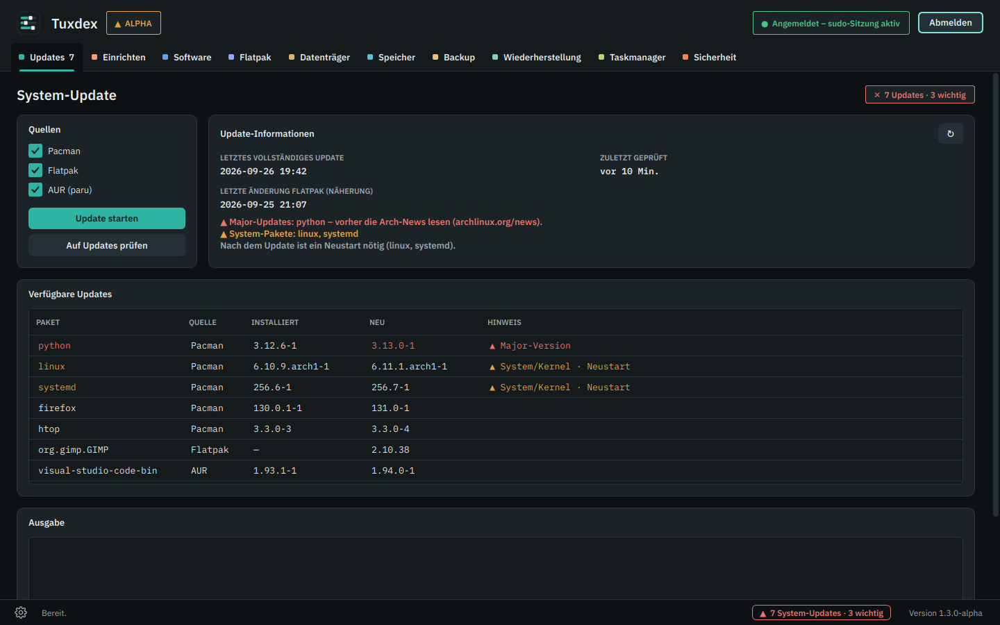 | 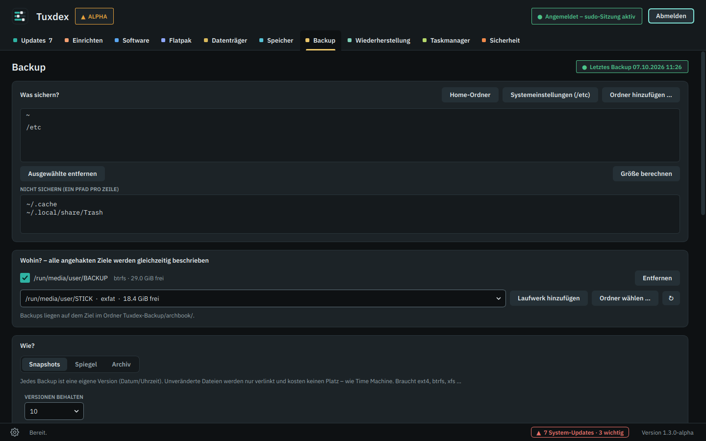 |
| **Software** | **Flatpak** |
| 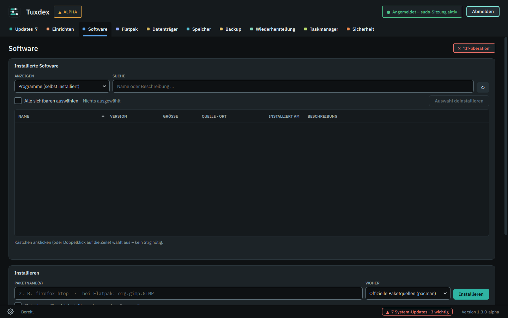 | 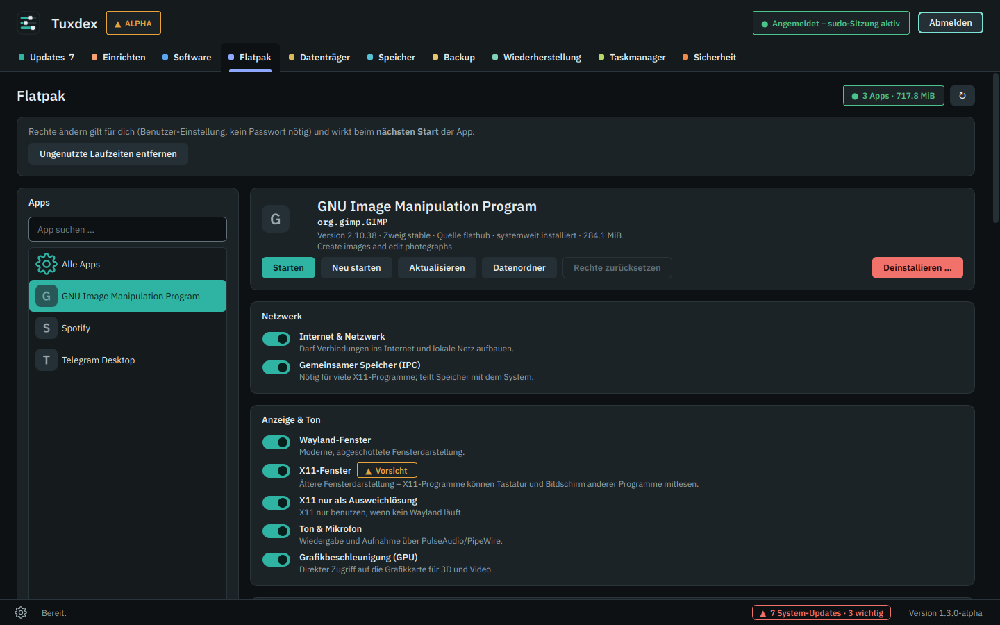 |
| **Datenträger** | **Speicher** |
| 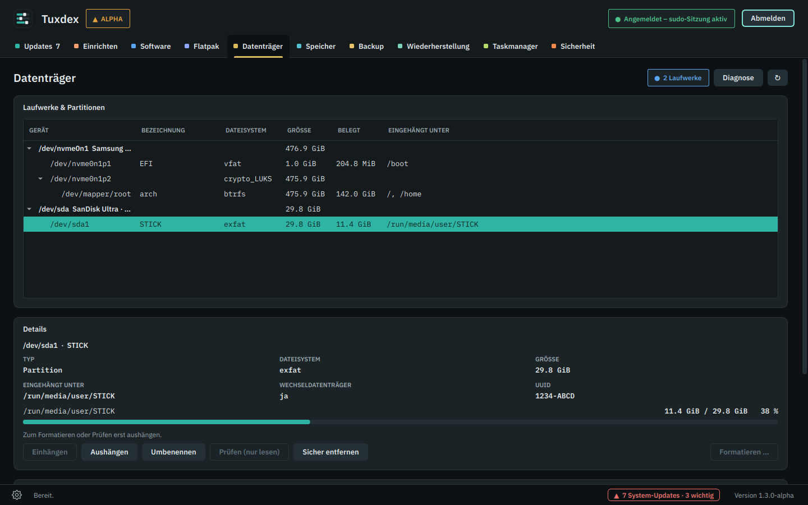 | 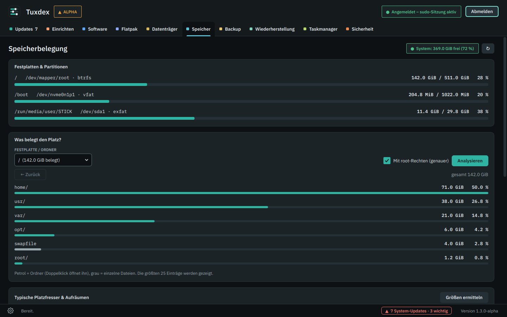 |
| **Sicherheit** | **Taskmanager** |
| 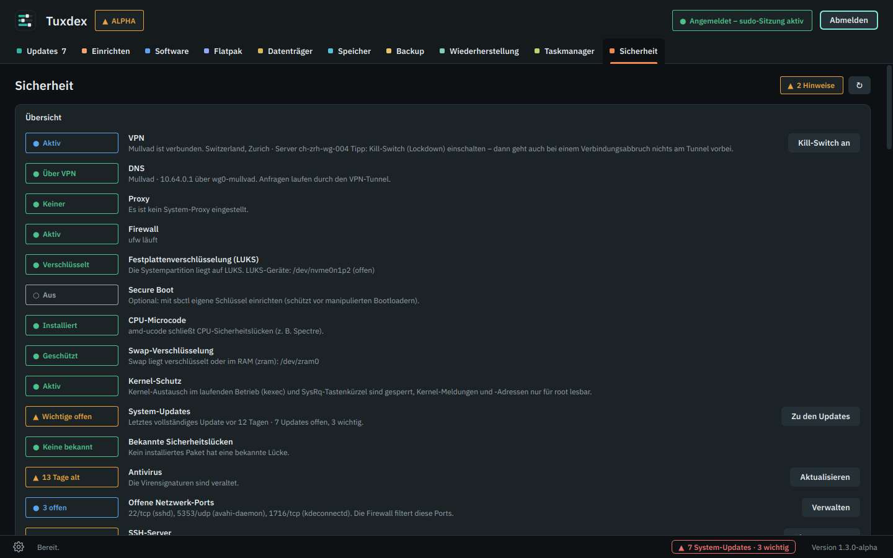 | 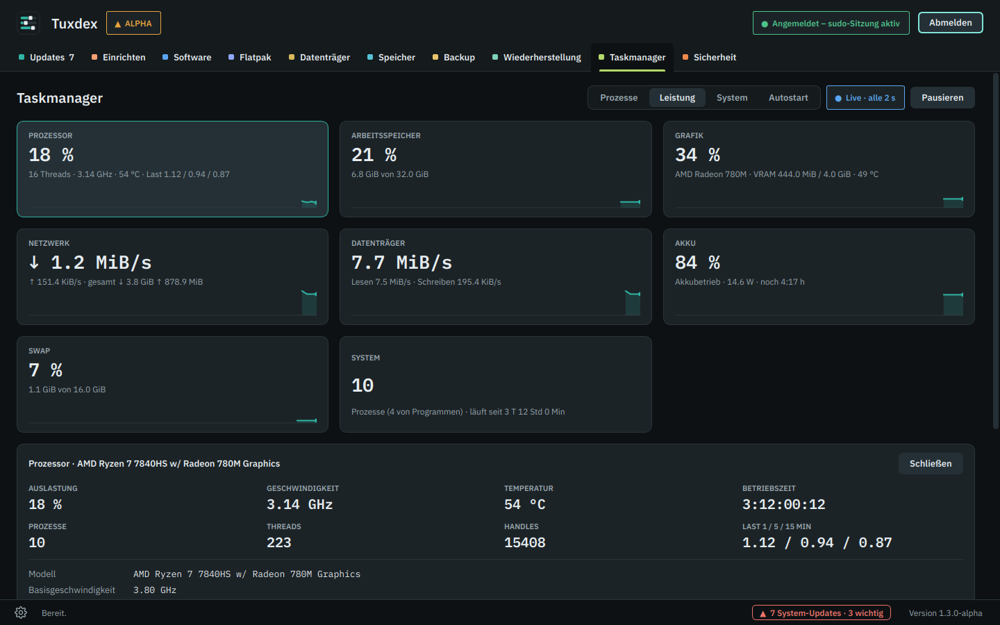 |
| **Checkliste** | **Module (Einstellungen)** |
| 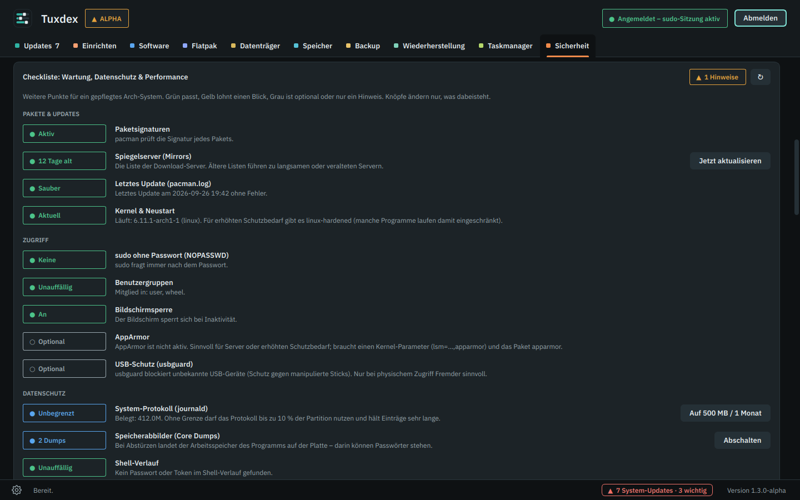 | 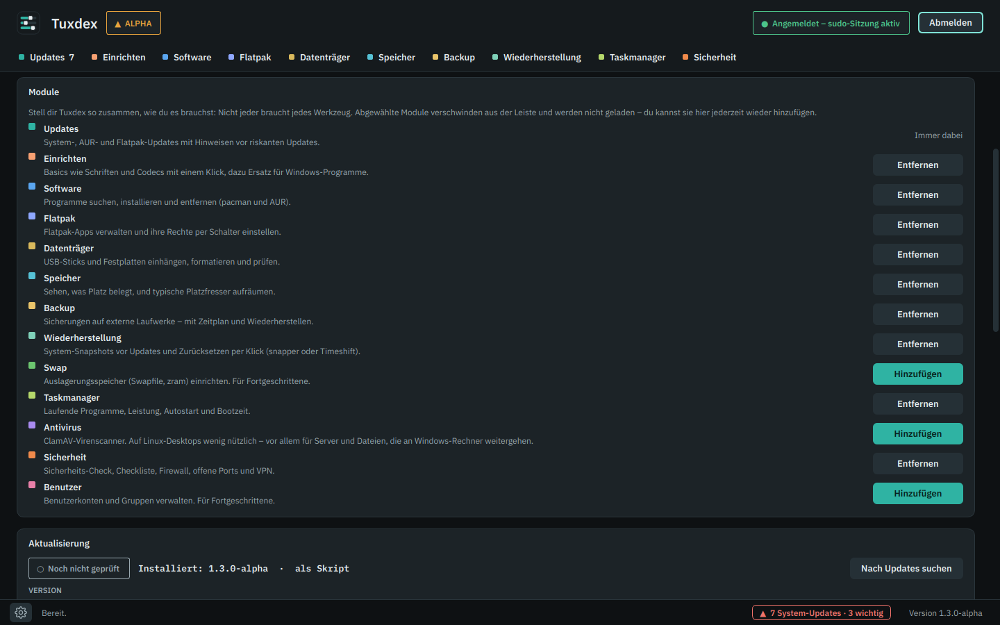 |
| **Wiederherstellung** | **Einrichten** |
| 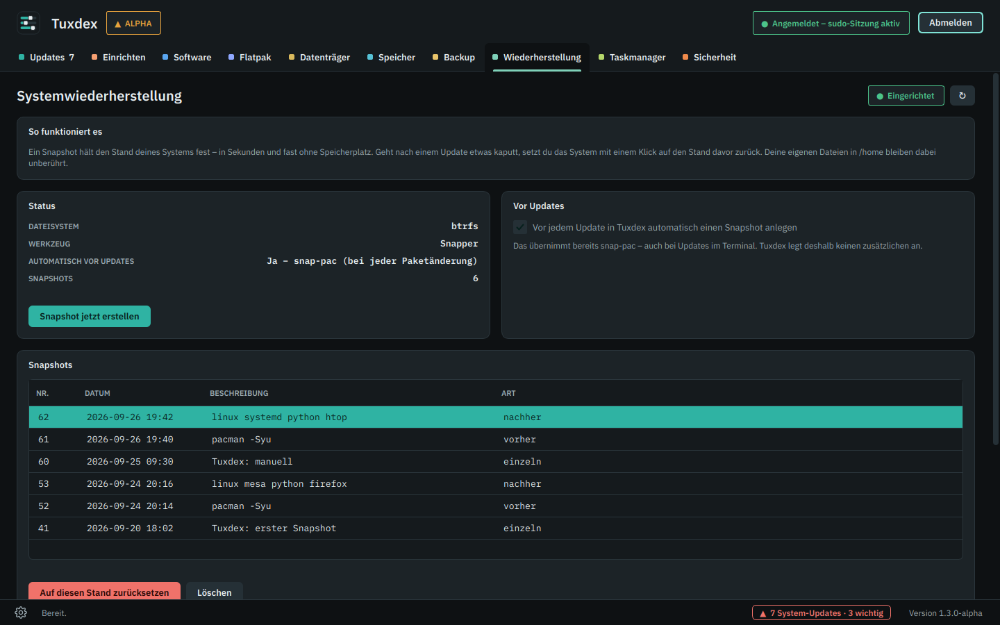 | 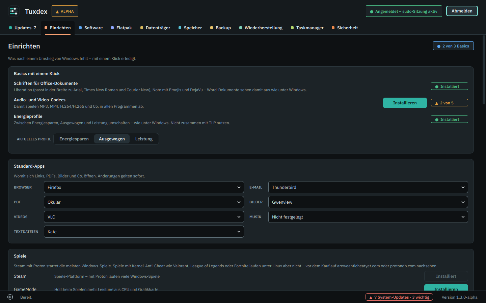 |
| **Standard-Apps & Spiele** | |
| 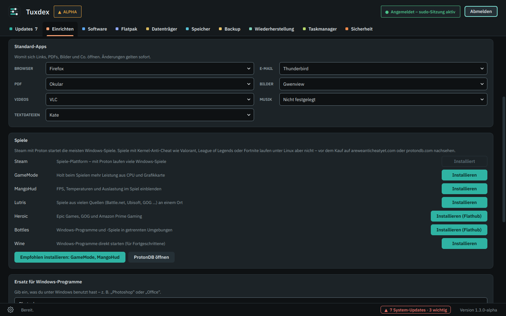 | |

<sub>Die Screenshots zeigen Beispieldaten.</sub>

## Installation

### Über pacman (empfohlen)

Tuxdex hat ein eigenes pacman-Repository – ohne AUR, Updates kommen mit `pacman -Syu`. Einmal in `/etc/pacman.conf` ganz unten eintragen:

```ini
[tuxdex]
SigLevel = Optional TrustAll
Server = https://github.com/PyloGER/Tuxdex/releases/latest/download
```

Dann installieren:

```bash
sudo pacman -Sy tuxdex
```

`SigLevel = Optional TrustAll` heißt: Die Pakete sind (noch) nicht mit einem eigenen Schlüssel signiert, pacman vertraut der HTTPS-Verbindung zu GitHub. Sobald Signaturen verfügbar sind, steht hier, wie du den Schlüssel importierst.

### Selbst bauen

Voraussetzung: `base-devel` und `git`.

```bash
git clone https://github.com/PyloGER/Tuxdex.git tuxdex
cd tuxdex
makepkg -si
```

`makepkg` installiert fehlende Abhängigkeiten, baut das Paket und installiert es über pacman. Danach findest du **Tuxdex** im Anwendungsmenü, im Terminal startet es mit `tuxdex`.

### Aktualisieren

Tuxdex prüft beim Start automatisch, ob es eine neue Version gibt, und bietet sie in einem Fenster an (abschaltbar unter **Zahnrad unten links → Aktualisierung**). Dort lässt sich auch jederzeit von Hand prüfen: Tuxdex prüft das GitHub-Repository, zeigt die Neuerungen und installiert die neue Version per Klick (baut mit makepkg, installiert mit pacman, startet neu). Alternativ „Aus Datei …“ (tuxdex-X.Y.Z.tar.gz) oder „Aus Ordner …“ (z. B. dein Git-Klon – vorher wird automatisch `git pull` ausgeführt).

Oder im Terminal:

```bash
cd tuxdex
git pull
makepkg -si
```

### Entfernen

```bash
sudo pacman -R tuxdex
```

Gespeicherte Update-Prüfung und Quarantäne liegen in `~/.cache/tuxdex` und `~/.local/share/tuxdex` und bleiben beim Entfernen erhalten.

### Ohne Installation ausprobieren

```bash
sudo pacman -S --needed python pyside6
python3 tuxdex.py
```

## Backups benennen

Unter **Backup → Name der Sicherung** legst du fest, wie Snapshot-Ordner und Archiv-Dateien heißen. So siehst du schon am Namen, von wann eine Sicherung ist.

Du schreibst beliebigen Text und setzt das Datum mit Platzhaltern ein:

| Platzhalter | wird zu | Beispiel |
|---|---|---|
| `yyyy` | Jahr | 2026 |
| `mm` | Monat | 09 |
| `dd` | Tag | 27 |
| `HH` | Stunde | 10 |
| `MM` | Minute | 15 |
| `SS` | Sekunde | 00 |

Beispiele (Sicherung am 27.09.2026 um 10:15 Uhr):

| Eingabe | Name der Sicherung |
|---|---|
| *(leer)* | `2026-09-27_101500` (Standard) |
| `yyyy-mm-dd` | `2026-09-27` |
| `Laptop_yyyy-mm-dd` | `Laptop_2026-09-27` |
| `yyyy-mm-dd vor Update` | `2026-09-27 vor Update` |
| `Fotos yyyymmdd_HHMM` | `Fotos 20260927_1015` |

- Ein Platzhalter wird nur ersetzt, wenn er nicht direkt an Buchstaben grenzt. `Sommer` bleibt also `Sommer`. Trenne Text und Platzhalter mit `_`, `-`, Punkt oder Leerzeichen.
- Kleines `mm` ist der Monat, großes `MM` die Minute.
- Gibt es den Namen auf einem Ziel schon (z. B. zwei Sicherungen am selben Tag mit `yyyy-mm-dd`), hängt Tuxdex `_2`, `_3` … an. Nimm `HH` und `MM` dazu, wenn du öfter am Tag sicherst.
- Archive bekommen die Endung automatisch dazu (`.tar.zst`, `.tar.xz` …, verschlüsselt zusätzlich `.gpg`).
- Unter dem Eingabefeld zeigt Tuxdex, wie die Sicherung heute heißen würde.
- Beim Spiegel gibt es keinen Namen, er ist immer nur eine Kopie.
- Sortieren und Aufräumen alter Versionen richten sich nach dem echten Sicherungszeitpunkt, nicht nach dem Namen. Tuxdex merkt ihn sich in `Tuxdex-Backup/<Rechnername>/.tuxdex-names.json` auf dem Ziel. Ältere Sicherungen mit dem Standardnamen bleiben unverändert.

## Abhängigkeiten

**Pflicht** (installiert `makepkg -si` automatisch): `python`, `pyside6`, `sudo`, `util-linux`, `iproute2`, `pciutils`, `hwdata`, `pacman-contrib`, `ttf-ibm-plex`, `rsync`

**Optional**, je nach genutzten Funktionen. Tuxdex läuft auch ohne diese Pakete – fehlt eines, ist nur der passende Bereich inaktiv. ClamAV und Mullvad installiert Tuxdex nicht selbst; wer sie nutzen möchte, installiert sie eigenständig.

| Paket | Wofür |
|---|---|
| `paru` (AUR) | AUR-Pakete aktualisieren und installieren |
| `flatpak` | Flatpak-Apps |
| `udisks2` | USB-Sticks ohne Passwort einhängen und sicher entfernen |
| `dosfstools`, `exfatprogs`, `ntfs-3g`, `btrfs-progs`, `xfsprogs` | Formatieren in FAT32, exFAT, NTFS, btrfs, xfs |
| `clamav` | Virenscanner |
| `ufw` | Firewall |
| `mullvad-vpn-daemon` | Mullvad VPN |
| `sbctl` | Secure Boot einrichten |

## Datenschutz & Sicherheit

<p align="center">
  
</p>

- **Keine Telemetrie.** Tuxdex sammelt keine Nutzungsdaten. Ins Internet geht es nur für die Update-Prüfung (GitHub, abschaltbar) und für Prüfungen, die du selbst anklickst: **„Öffentliche IP prüfen“** (am.i.mullvad.net) und den **Leak-Test** (bash.ws, ipapi.is, am.i.mullvad.net).
- **Passwort:** Das sudo-Passwort geht direkt an `sudo -v` und wird weder gespeichert noch protokolliert. Weitere Befehle nutzen die bestehende sudo-Sitzung (`sudo -n`).
- **Mullvad-Kontonummer:** geht direkt an `mullvad account login` und wird weder angezeigt noch protokolliert.
- **Schutz vor Fehlbedienung:** System-Partitionen (`/`, `/boot`, `/home`, Swap) lassen sich nicht aushängen oder formatieren. Formatieren verlangt das Eintippen des Gerätenamens, direkt davor prüft Tuxdex noch einmal, ob die Partition wirklich ausgehängt ist. Destruktive Aktionen fragen immer nach.

## Projektstruktur

```
tuxdex.py              Die komplette Anwendung (eine Datei)
tuxdex                 Startskript für /usr/bin
tuxdex.desktop         Eintrag im Anwendungsmenü
tuxdex.svg, *.png      App-Icon in allen Größen
PKGBUILD               Bauanleitung für makepkg / pacman
CHANGELOG.md           Änderungen je Version
CHANGELOG.en.md        Änderungen je Version (englisch, für den Updater bei Englisch)
docs/                  Screenshots, README-Grafiken und Logo-Varianten
tools/                 Hilfsskripte (z. B. fehlende Übersetzungen finden)
.github/workflows/     Legt für jede neue Version auf main ein GitHub-Release und das pacman-Repo an
```

## Mitmachen

Fehler gefunden oder eine Idee? Gern ein [Issue](../../issues) oder einen Pull Request.
Bei Fehlern helfen die Datei `~/tuxdex_error.log` und die Angaben unter **Einstellungen → Technik** (Zahnrad unten links).

Nach Änderungen an Dateien, die im `PKGBUILD` stehen, die Prüfsummen aktualisieren:

```bash
updpkgsums   # aus pacman-contrib
```

Neue oder geänderte Oberflächentexte brauchen eine englische Übersetzung im Katalog `EN` am Ende von `tuxdex.py`. `python3 tools/i18n_extract.py` listet fehlende auf.

## Entstehung

Tuxdex ist ein **KI-gestütztes Projekt (AI made)**: Idee, Anforderungen und Tests kommen von PyloGER (Voxellab), der Code, das Design und die Dokumentation sind in Zusammenarbeit mit **Claude** von Anthropic entstanden.

## Lizenz

[MIT](LICENSE) © 2026 PyloGER · Voxellab

---

<sub>Tuxdex ist ein unabhängiges Community-Projekt und steht in keiner Verbindung zu Arch Linux, Mullvad VPN oder ClamAV und wird von ihnen weder unterstützt noch empfohlen. „Arch Linux“ und alle weiteren Marken gehören ihren jeweiligen Inhabern und werden hier nur beschreibend verwendet.</sub>
